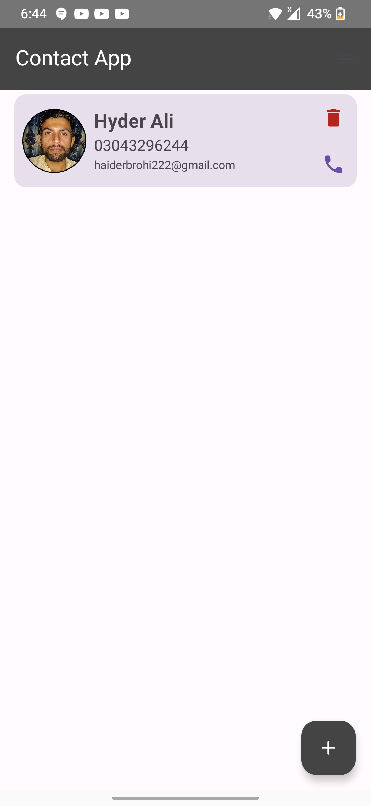
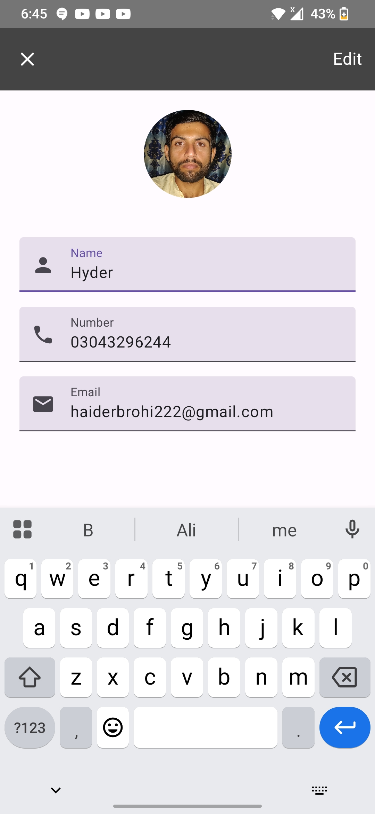

# 📱 EasyContacts App

**EasyContact App** is a simple yet modern Android application that allows users to manage their personal contacts efficiently. Built with the latest Android development tools including Jetpack Compose, Room Database, Dagger Hilt, and Kotlin Flows.

---

## ✨ Features

- ➕ Add new contacts
- ✏️ Edit existing contacts
- 🗑️ Delete contacts
- 👀 View all saved contacts
- 🔄 Kotlin Flows
- 📐 MVVM architecture for clean and maintainable code

---

## 🛠️ Tech Stack

| Tool               | Usage                             |
|--------------------|------------------------------------|
| **Kotlin**         | Programming language               |
| **Jetpack Compose**| Modern declarative UI framework    |
| **Room Database**  | Local database for storing contacts|
| **Dagger Hilt**    | Dependency Injection               |
| **MVVM Pattern**   | Separation of concerns and UI logic|

---

## 🧱 Architecture

The app follows the **MVVM (Model - ViewModel - View)** architecture for better testability and separation of concerns.

---

## 📷 Screenshots

### 🏠 Home Screen  

  
  

### ✏️ Edit Contact  

